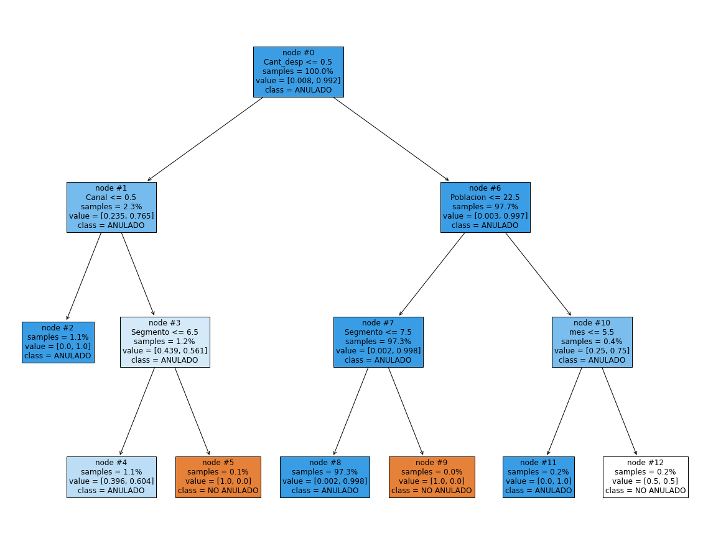

**Código para análisis de árbol de decisión - README**

Este repositorio contiene el código en Python para realizar el análisis de un árbol de decisión utilizando el conjunto de datos **DT.csv**. A continuación, se proporciona una descripción general del contenido y los pasos realizados en el código.

**Contenido del repositorio**

- **arbol\_decision.py**: Archivo Python que contiene el código para el análisis del árbol de decisión.
- **DT.csv**: Conjunto de datos en formato CSV utilizado para el análisis.

**Pasos realizados en el código**

1. **Carga de bibliotecas**: Se importan las bibliotecas necesarias, como pandas, sklearn y matplotlib, para el análisis de datos y la visualización del árbol de decisión.
1. **Carga de datos**: Se carga el conjunto de datos **DT.csv** utilizando la función **read\_csv()** de pandas.
1. **Preprocesamiento de datos**: Se realiza una serie de transformaciones en los datos, como eliminación de columnas innecesarias, codificación de variables categóricas utilizando **LabelEncoder**, manipulación de fechas y eliminación de registros con valores faltantes.
1. **Separación de variables**: Se separan las variables independientes (**X**) y la variable dependiente (**y**) para construir el árbol de decisión.
1. **Construcción del árbol de decisión**: Se construye un árbol de decisión utilizando la clase **DecisionTreeClassifier** de sklearn. Se establece la profundidad máxima del árbol en 3.
1. **Visualización del árbol de decisión**: Se visualiza el árbol de decisión utilizando la función **plot\_tree()** de sklearn y se muestra mediante **matplotlib**.
1. **Exportación del árbol de decisión**: Se comentan las líneas de código para exportar el árbol de decisión en formato SVG o PDF, utilizando las funciones **export\_graphviz()** y **graph.render()** de graphviz.

**Requisitos del entorno**

- Python 3.x
- Bibliotecas: pandas, sklearn, matplotlib, graphviz

**Ejecución del código**

1. Asegúrese de tener Python 3.x y las bibliotecas requeridas instaladas.
1. Descargue el repositorio y extraiga los archivos en su directorio de trabajo.
1. Abra el archivo **arbol\_decision.py** en su entorno de desarrollo o editor de texto.
1. Ejecute el código para realizar el análisis del árbol de decisión.
1. Se mostrará la visualización del árbol de decisión en una ventana emergente utilizando **matplotlib**.

¡Disfrute del análisis del árbol de decisión y la comprensión de los patrones presentes en el conjunto de datos! Si desea exportar el árbol de decisión en otros formatos, descomente las líneas de código relevantes y proporcione la ruta de archivo deseada.

**Arbol resultante**

Arbol de decision completo

Arbol de decision resumido

